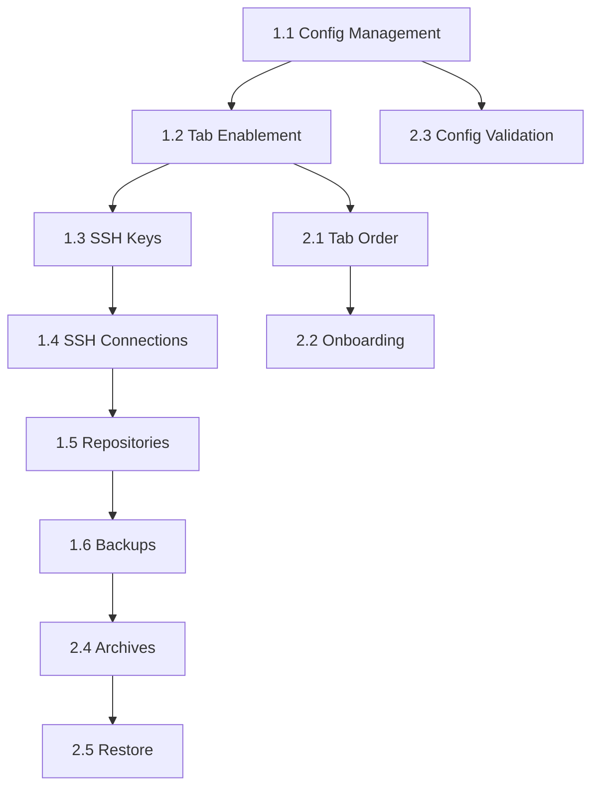

# Implementation Tasks - Guided Workflow & Configuration-First Design

## Overview
This document breaks down the implementation of the new system design into manageable tasks. Tasks are organized by priority and dependencies.

## Phase 1: Core Workflow Foundation (HIGH PRIORITY)

### Task 1.1: Configuration Management Enhancement
**Status**: 🔴 TODO
**Files**:
- `app/api/config.py`
- `app/models/config.py`
- `frontend/src/pages/Config.tsx`

**Backend Changes**:
- [ ] Add `is_default` field to Configuration model
- [ ] Add endpoint: `POST /api/config/{id}/set-default`
- [ ] Add endpoint: `GET /api/config/default`
- [ ] Ensure only one config can be default at a time
- [ ] Add config validation check endpoint
- [ ] Return validation status in config response

**Frontend Changes**:
- [ ] Add configuration selector dropdown at top of Config page
- [ ] Show "Set as Default" button for non-default configs
- [ ] Show "Default" badge on default config
- [ ] Add visual indicator when no default is selected
- [ ] Update state management to track default config
- [ ] Create context for configuration state

**Acceptance Criteria**:
- User can create multiple configurations
- Only one configuration can be marked as default
- Default configuration is persisted across sessions
- Clear visual indication of which config is default

---

### Task 1.2: Tab Enablement System
**Status**: 🔴 TODO
**Files**:
- `frontend/src/components/Layout.tsx`
- `frontend/src/hooks/useAppState.ts` (new)
- `frontend/src/context/AppContext.tsx` (new)

**Implementation**:
- [ ] Create AppContext for global state management
- [ ] Create useAppState hook to check:
  - `hasValidConfig`: Is there a valid default config?
  - `hasSSHKey`: Does SSH key exist?
  - `hasRepositories`: Are there any repositories?
  - `hasArchives`: Are there any archives?

- [ ] Update Layout navigation to:
  - Disable tabs based on state
  - Show lock icon on disabled tabs
  - Show tooltip explaining why disabled
  - Highlight enabled tabs

- [ ] Update routing to redirect if accessing disabled tab

**Tab Enablement Rules**:
```typescript
Dashboard: true (always)
Configuration: true (always)
SSH Keys: hasValidConfig
Connections: hasValidConfig
Repositories: hasValidConfig
Backups: hasValidConfig && hasRepositories
Archives: hasValidConfig && hasRepositories
Restore: hasValidConfig && hasArchives
Schedule: hasValidConfig
Settings: true (always)
```

**Acceptance Criteria**:
- Tabs are disabled until prerequisites are met
- Clear visual feedback for disabled state
- Helpful tooltips explain requirements
- Routing prevents access to disabled tabs

---

### Task 1.3: SSH Key Management (Single Key System)
**Status**: 🔴 TODO
**Files**:
- `app/api/ssh_keys.py`
- `app/models/ssh_key.py`
- `frontend/src/pages/SSHKeys.tsx`

**Backend Changes**:
- [ ] Modify SSH key model to enforce single key
- [ ] Remove create multiple keys functionality
- [ ] Add endpoint: `GET /api/ssh-keys/system-key` (returns THE key or null)
- [ ] Add endpoint: `POST /api/ssh-keys/generate` (one-time only)
- [ ] Remove delete key functionality
- [ ] Return key status: exists/not-exists

**Frontend Changes**:
- [ ] Complete UI redesign for single key paradigm
- [ ] Show two states:
  - **No Key**: "Create SSH Key" button + explanation
  - **Key Exists**: Show public key, fingerprint (read-only)
- [ ] Remove all multi-key UI elements
- [ ] Remove delete/edit functionality
- [ ] Add "Copy Public Key" button
- [ ] Show clear message: "This is your system's SSH key used for all remote connections"

**Acceptance Criteria**:
- Only one SSH key can exist per system
- Key creation is one-time operation
- No ability to delete or recreate key
- Public key easily accessible for copying
- Clear messaging about single-key system

---

### Task 1.4: SSH Connections with Auto-Key Assignment
**Status**: 🔴 TODO
**Files**:
- `app/api/connections.py`
- `frontend/src/pages/SSHConnections.tsx` (or within unified page)

**Backend Changes**:
- [ ] Remove `ssh_key_id` field from connection model
- [ ] Automatically use system SSH key for all connections
- [ ] Add validation: SSH key must exist before creating connection
- [ ] Enhance test connection to use system key
- [ ] Return error if no system key exists

**Frontend Changes**:
- [ ] Remove SSH key selection from connection form
- [ ] Show warning if no SSH key exists: "Please create an SSH key first in the SSH Keys tab"
- [ ] Disable "Add Connection" if no SSH key
- [ ] Simplify form to: hostname, username, port only
- [ ] Add "Test Connection" button
- [ ] Show connection status clearly
- [ ] Update existing connections to remove key association

**Acceptance Criteria**:
- Connections cannot be created without system SSH key
- All connections automatically use the system key
- Clear warning when SSH key doesn't exist
- Test connection works before saving
- Connection form is simple and intuitive

---

### Task 1.5: Repository Creation with Context
**Status**: 🔴 TODO
**Files**:
- `app/api/repositories.py`
- `frontend/src/pages/Repositories.tsx`

**Backend Changes**:
- [ ] Add repository initialization endpoint
- [ ] Support two types: local and remote (SSH)
- [ ] For remote: validate SSH connection exists
- [ ] Execute `borg init` command
- [ ] Return detailed error messages
- [ ] Add repository to configuration after creation

**Frontend Changes**:
- [ ] Add explanatory header:
  ```
  "A repository is where your backed-up data will be stored.
   The files from your configured sources will be backed up here."
  ```
- [ ] Show configured source directories from default config
- [ ] Add two prominent buttons:
  - "Create Local Repository"
  - "Create Remote Repository (SSH)"

- [ ] **Local Repository Form**:
  - Path input
  - Validation: path must be valid
  - Show `borg init` command preview

- [ ] **Remote Repository Form**:
  - SSH Connection dropdown (from existing connections)
  - Show warning if no connections exist
  - Remote path input
  - Show `borg init` command preview

- [ ] Show success message with full path
- [ ] Update configuration with new repository

**Acceptance Criteria**:
- Clear explanation of what repository is
- Users understand where backups will be stored
- Easy choice between local/remote
- Validation prevents invalid repositories
- Success feedback is clear

---

### Task 1.6: Backup Execution with Real-time Logging
**Status**: 🔴 TODO
**Files**:
- `app/api/backups.py`
- `app/services/backup_service.py`
- `frontend/src/pages/Backup.tsx`

**Backend Changes**:
- [ ] Create backup execution service
- [ ] Execute `borgmatic --verbosity 1 --files`
- [ ] Stream output to log file
- [ ] Create endpoint: `POST /api/backups/start`
- [ ] Create endpoint: `GET /api/backups/{id}/logs` (returns new log entries)
- [ ] Track backup status: running, completed, failed
- [ ] **Show exact error messages** - no interpretation

**Frontend Changes**:
- [ ] Add "Start Backup" button (disabled if no repository)
- [ ] Show terminal-style log viewer
- [ ] Poll `/logs` endpoint every 2-3 seconds
- [ ] Auto-scroll to latest log entry
- [ ] Show backup status (running/completed/failed)
- [ ] Add "Copy Logs" button
- [ ] Display timestamps
- [ ] **Show errors exactly as returned** - no friendly messages

**Log Display Example**:
```
[2025-01-15 10:30:00] Starting backup...
[2025-01-15 10:30:01] borgmatic --verbosity 1 --files
[2025-01-15 10:30:02] Creating archive...
[2025-01-15 10:30:05] A /home/user/documents/file1.txt
[2025-01-15 10:30:05] A /home/user/documents/file2.txt
[2025-01-15 10:30:10] Archive created successfully
```

**Acceptance Criteria**:
- Backups run with verbose logging
- Logs stream in real-time
- Errors are shown exactly as returned
- Status updates are clear
- User can copy logs for debugging

---

## Phase 2: Enhanced Features (MEDIUM PRIORITY)

### Task 2.1: Tab Order Reorganization
**Status**: 🔴 TODO
**Files**: `frontend/src/components/Layout.tsx`

**New Tab Order**:
1. Dashboard
2. Configuration
3. SSH Keys
4. Connections
5. Repositories
6. Backups
7. Archives
8. Restore
9. Schedule
10. Settings

**Changes**:
- [ ] Update navigation order
- [ ] Update routing order
- [ ] Ensure flow is intuitive
- [ ] Add progress indicator showing completion

**Acceptance Criteria**:
- Tab order follows logical workflow
- Easy to understand what comes next
- Visual flow indicators

---

### Task 2.2: Onboarding & Help System
**Status**: 🔴 TODO
**Files**:
- `frontend/src/components/OnboardingGuide.tsx` (new)
- All page components

**Implementation**:
- [ ] Create onboarding wizard for first-time users
- [ ] Add contextual help at top of each page
- [ ] Show prerequisites for disabled tabs
- [ ] Add "What's Next?" suggestions
- [ ] Create progress tracking component

**Acceptance Criteria**:
- First-time users are guided through setup
- Each page explains its purpose
- Clear next steps are provided
- Progress is visible

---

### Task 2.3: Configuration Validation & Feedback
**Status**: 🔴 TODO
**Files**:
- `app/api/config.py`
- `frontend/src/pages/Config.tsx`

**Implementation**:
- [ ] Run `borgmatic config validate` on save
- [ ] Show validation results clearly
- [ ] List source directories from config
- [ ] Show which repository is configured
- [ ] Validate before allowing other tabs

**Acceptance Criteria**:
- Configs are validated before use
- Validation errors are clear
- User knows exactly what's configured

---

### Task 2.4: Archive Management
**Status**: 🔴 TODO
**Files**: `frontend/src/pages/Archives.tsx`

**Changes**:
- [ ] Ensure enabled only after first backup
- [ ] Show clear message if no archives exist
- [ ] Archive listing with metadata
- [ ] File browsing within archives

**Acceptance Criteria**:
- Archives page makes sense in workflow
- Clear feedback when no archives exist
- Easy to browse backup contents

---

### Task 2.5: Restore Functionality
**Status**: 🔴 TODO
**Files**: `frontend/src/pages/Restore.tsx`

**Changes**:
- [ ] Ensure enabled only after archives exist
- [ ] Archive selection
- [ ] File/directory selection
- [ ] Restore with logging (similar to backup)

**Acceptance Criteria**:
- Restore follows same logging pattern
- Errors are shown exactly
- User can track restore progress

---

## Phase 3: Polish & Documentation (LOW PRIORITY)

### Task 3.1: Update README
**Status**: 🔴 TODO
**Files**: `README.md`

**Changes**:
- [ ] Add link to SYSTEM_DESIGN.md
- [ ] Document new workflow
- [ ] Update screenshots
- [ ] Add troubleshooting guide

---

### Task 3.2: Enhanced Error Display
**Status**: 🔴 TODO
**Files**: All API endpoints

**Implementation**:
- [ ] Ensure all errors return raw messages
- [ ] Remove any "friendly" error interpretations
- [ ] Log full command output
- [ ] Return stderr along with error

---

### Task 3.3: Performance Optimization
**Status**: 🔴 TODO

**Implementation**:
- [ ] Optimize log polling frequency
- [ ] Add caching where appropriate
- [ ] Lazy load heavy components

---

## Task Dependencies



## Testing Checklist

### Integration Tests
- [ ] Configuration selection and validation
- [ ] Tab enablement based on state
- [ ] SSH key creation (one-time)
- [ ] SSH connection with auto-key
- [ ] Local repository initialization
- [ ] Remote repository initialization
- [ ] Backup execution with logging
- [ ] Log streaming
- [ ] Archive browsing
- [ ] Restore functionality

### User Flow Tests
- [ ] New user completes entire workflow
- [ ] User cannot access features out of order
- [ ] Error messages are helpful
- [ ] Progress is trackable
- [ ] Backups complete successfully

### Edge Cases
- [ ] No default config selected
- [ ] SSH key exists but no connections
- [ ] Repository initialization fails
- [ ] Backup fails mid-execution
- [ ] Network connection drops during remote backup

---

## Progress Tracking

**Phase 1**: 0/6 tasks completed (0%)
**Phase 2**: 0/5 tasks completed (0%)
**Phase 3**: 0/3 tasks completed (0%)
**Overall**: 0/14 tasks completed (0%)

---

## Next Steps

1. Review SYSTEM_DESIGN.md and this task breakdown
2. Approve overall approach
3. Begin with Task 1.1 (Configuration Management)
4. Work through Phase 1 in order
5. Test each task before moving to next
6. Document any deviations or learnings

---

**Document Status**: Draft for Review
**Last Updated**: 2025-01-15
**Version**: 1.0
