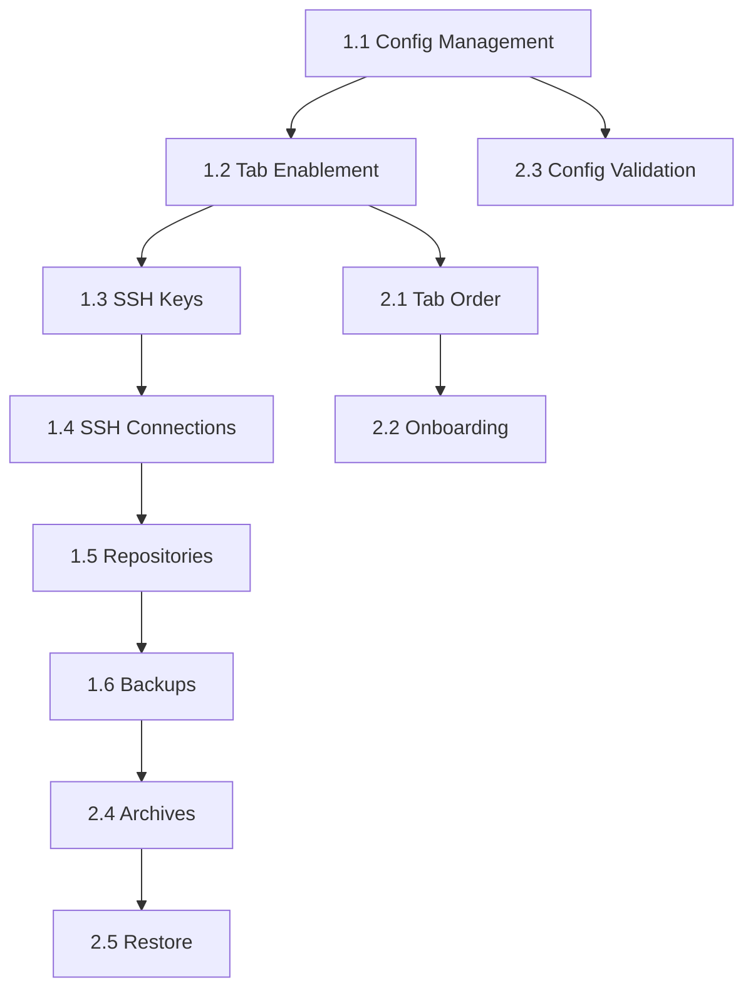

# Implementation Tasks - Guided Workflow & Configuration-First Design

## Overview
This document breaks down the implementation of the new system design into manageable tasks. Tasks are organized by priority and dependencies.

## Phase 1: Core Workflow Foundation (HIGH PRIORITY)

### Task 1.1: Configuration Management Enhancement
**Status**: ✅ COMPLETE
**Files**:
- `app/api/config.py`
- `app/database/models.py`
- `frontend/src/pages/Config.tsx`

**Backend Changes**:
- [x] Add `is_default` field to Configuration model
- [x] Add endpoint: `POST /api/config/{id}/set-default`
- [x] Add endpoint: `GET /api/config/default`
- [x] Ensure only one config can be default at a time
- [x] Add config validation check endpoint
- [x] Return validation status in config response
- [x] **BONUS**: Add borgmatic CLI config generator endpoint

**Frontend Changes**:
- [x] Add configuration selector dropdown at top of Config page
- [x] Show "Set as Default" button for non-default configs
- [x] Show "Default" badge on default config
- [x] Add visual indicator when no default is selected
- [x] Update state management to track default config
- [x] Create context for configuration state (AppContext)
- [x] **BONUS**: Replace templates with borgmatic CLI generator

**Acceptance Criteria**:
- ✅ User can create multiple configurations
- ✅ Only one configuration can be marked as default
- ✅ Default configuration is persisted across sessions
- ✅ Clear visual indication of which config is default
- ✅ Configurations always up-to-date via borgmatic CLI

---

### Task 1.2: Tab Enablement System
**Status**: ✅ COMPLETE
**Files**:
- `frontend/src/components/Layout.tsx`
- `frontend/src/hooks/useAppState.ts`
- `frontend/src/context/AppContext.tsx`
- `frontend/src/components/ProtectedRoute.tsx`

**Implementation**:
- [x] Create AppContext for global state management
- [x] Create useAppState hook to check:
  - `hasValidConfig`: Is there a valid default config?
  - `hasSSHKey`: Does SSH key exist?
  - `hasRepositories`: Are there any repositories?
  - `hasArchives`: Are there any archives?

- [x] Update Layout navigation to:
  - Disable tabs based on state
  - Show lock icon on disabled tabs
  - Show tooltip explaining why disabled
  - Highlight enabled tabs

- [x] Update routing to redirect if accessing disabled tab
- [x] Create ProtectedRoute component for route guards

**Tab Enablement Rules**:
```typescript
Dashboard: true (always)
Configuration: true (always)
SSH Keys: hasValidConfig
Connections: hasValidConfig
Repositories: hasValidConfig
Backups: hasValidConfig && hasRepositories
Archives: hasValidConfig && hasRepositories
Restore: hasValidConfig && hasArchives
Schedule: hasValidConfig
Settings: true (always)
```

**Acceptance Criteria**:
- ✅ Tabs are disabled until prerequisites are met
- ✅ Clear visual feedback for disabled state
- ✅ Helpful tooltips explain requirements
- ✅ Routing prevents access to disabled tabs

---

### Task 1.3: SSH Key Management (Single Key System)
**Status**: ✅ COMPLETE
**Files**:
- `app/api/ssh_keys.py`
- `app/database/models.py`
- `frontend/src/pages/SSHConnectionsSingleKey.tsx`
- `frontend/src/services/api.ts`

**Backend Changes**:
- [x] Modify SSH key model to enforce single key
- [x] Add endpoint: `GET /api/ssh-keys/system-key` (returns THE key or null)
- [x] Add endpoint: `POST /api/ssh-keys/generate` (generates system key)
- [x] Return key status: exists/not-exists
- [x] Deploy and test connection functionality
- [x] Support multiple key types: ED25519, RSA, ECDSA

**Frontend Changes**:
- [x] Complete UI redesign for single key paradigm (SSHConnectionsSingleKey.tsx)
- [x] Show two states:
  - **No Key**: "Generate System SSH Key" button + explanation
  - **Key Exists**: Show public key, fingerprint (read-only)
- [x] Remove all multi-key UI elements
- [x] Add "Copy Public Key" button with clipboard integration
- [x] Show clear message: "This is your system's SSH key used for all remote connections"
- [x] Add "Deploy to Server" dialog with connection form
- [x] Remote Connections table with status indicators
- [x] Statistics cards: Total/Active/Failed connections
- [x] Auto-refresh every 30 seconds
- [x] Key generation dialog with key type selector

**Acceptance Criteria**:
- ✅ Only one SSH key can exist per system
- ✅ Key creation is one-time operation (unless manually deleted from backend)
- ✅ Public key easily accessible for copying
- ✅ Clear messaging about single-key system
- ✅ Deploy key to remote servers with password authentication
- ✅ Test connections to verify SSH access

---

### Task 1.4: SSH Connections with Auto-Key Assignment
**Status**: ✅ COMPLETE (merged with Task 1.3)
**Files**:
- `app/api/ssh_keys.py`
- `frontend/src/pages/SSHConnectionsSingleKey.tsx`

**Implementation Note**: This task was completed as part of Task 1.3. The single-key SSH system inherently implements auto-key assignment - all connections automatically use the system SSH key.

**Backend Changes**:
- [x] System SSH key automatically used for all connections
- [x] Validation: SSH key must exist before deploying to servers
- [x] Test connection uses system key
- [x] Returns error if no system key exists

**Frontend Changes**:
- [x] No SSH key selection needed (single key system)
- [x] Warning shown if no SSH key exists
- [x] "Deploy to Server" disabled if no SSH key
- [x] Form simplified to: hostname, username, port, password (for initial deployment)
- [x] "Test Connection" button integrated in connections table
- [x] Connection status clearly displayed with icons and status text

**Acceptance Criteria**:
- ✅ Connections cannot be created without system SSH key
- ✅ All connections automatically use the system key
- ✅ Clear warning when SSH key doesn't exist
- ✅ Test connection works for deployed connections
- ✅ Connection form is simple and intuitive

---

### Task 1.5: Repository Creation with Context
**Status**: ✅ COMPLETE
**Files**:
- `app/api/repositories.py`
- `frontend/src/pages/Repositories.tsx`

**Backend Changes**:
- [x] Add repository initialization endpoint
- [x] Support two types: local and remote (SSH)
- [x] For remote: validate SSH connection exists
- [x] Execute `borg init` command
- [x] Return detailed error messages
- [x] Add repository to configuration after creation

**Frontend Changes**:
- [x] Add explanatory header:
  ```
  "A repository is where your backed-up data will be stored.
   The files from your configured sources will be backed up here."
  ```
- [x] Show configured source directories from default config
- [x] Add two prominent buttons:
  - "Create Local Repository"
  - "Create Remote Repository (SSH)"

- [x] **Local Repository Form**:
  - Path input
  - Validation: path must be valid
  - Show `borg init` command preview

- [x] **Remote Repository Form**:
  - SSH Connection dropdown (from existing connections)
  - Show warning if no connections exist
  - Remote path input
  - Show `borg init` command preview

- [x] Show success message with full path
- [x] Update configuration with new repository

**Acceptance Criteria**:
- ✅ Clear explanation of what repository is
- ✅ Users understand where backups will be stored
- ✅ Easy choice between local/remote
- ✅ Validation prevents invalid repositories
- ✅ Success feedback is clear

---

### Task 1.6: Backup Execution with Real-time Logging
**Status**: ✅ COMPLETE
**Files**:
- `app/api/backup.py`
- `app/services/backup_service.py`
- `app/database/models.py`
- `frontend/src/pages/Backup.tsx`
- `frontend/src/components/TerminalLogViewer.tsx`
- `frontend/src/services/api.ts`

**Backend Changes**:
- [x] Create backup execution service (BackupService)
- [x] Execute `borgmatic create --verbosity 1 --files`
- [x] Stream output to log file (`/data/logs/backup_{job_id}.log`)
- [x] Create endpoint: `POST /api/backup/start`
- [x] Create endpoint: `GET /api/backup/logs/{job_id}/stream` (returns new log entries with offset)
- [x] Track backup status: pending, running, completed, failed, cancelled
- [x] Update BackupJob model with log_file_path, progress, logs fields
- [x] **Show exact error messages** - no interpretation

**Frontend Changes**:
- [x] Add "Start Backup" button (disabled if no repository)
- [x] Show terminal-style log viewer (TerminalLogViewer component)
- [x] Poll `/logs/{id}/stream` endpoint every 2 seconds while running
- [x] Auto-scroll to latest log entry with manual scroll detection
- [x] Show backup status (pending/running/completed/failed)
- [x] Add "Copy Logs" and "Download" buttons
- [x] Display timestamps and line numbers
- [x] Dark terminal theme (#1e1e1e background, #d4d4d4 text)
- [x] **Show errors exactly as returned** - no friendly messages

**Log Display Example**:
```
[2025-01-15 10:30:00] Starting backup...
[2025-01-15 10:30:01] borgmatic --verbosity 1 --files
[2025-01-15 10:30:02] Creating archive...
[2025-01-15 10:30:05] A /home/user/documents/file1.txt
[2025-01-15 10:30:05] A /home/user/documents/file2.txt
[2025-01-15 10:30:10] Archive created successfully
```

**Acceptance Criteria**:
- ✅ Backups run with verbose logging
- ✅ Logs stream in real-time with offset-based polling
- ✅ Errors are shown exactly as returned
- ✅ Status updates are clear (pending/running/completed/failed)
- ✅ User can copy logs for debugging and download as file
- ✅ Terminal-style UI with dark theme
- ✅ Auto-scroll with manual override capability

---

## Phase 2: Enhanced Features (MEDIUM PRIORITY)

### Task 2.1: Tab Order Reorganization
**Status**: 🔴 TODO
**Files**: `frontend/src/components/Layout.tsx`

**New Tab Order**:
1. Dashboard
2. Configuration
3. SSH Keys
4. Connections
5. Repositories
6. Backups
7. Archives
8. Restore
9. Schedule
10. Settings

**Changes**:
- [ ] Update navigation order
- [ ] Update routing order
- [ ] Ensure flow is intuitive
- [ ] Add progress indicator showing completion

**Acceptance Criteria**:
- Tab order follows logical workflow
- Easy to understand what comes next
- Visual flow indicators

---

### Task 2.2: Onboarding & Help System
**Status**: 🔴 TODO
**Files**:
- `frontend/src/components/OnboardingGuide.tsx` (new)
- All page components

**Implementation**:
- [ ] Create onboarding wizard for first-time users
- [ ] Add contextual help at top of each page
- [ ] Show prerequisites for disabled tabs
- [ ] Add "What's Next?" suggestions
- [ ] Create progress tracking component

**Acceptance Criteria**:
- First-time users are guided through setup
- Each page explains its purpose
- Clear next steps are provided
- Progress is visible

---

### Task 2.3: Configuration Validation & Feedback
**Status**: 🔴 TODO
**Files**:
- `app/api/config.py`
- `frontend/src/pages/Config.tsx`

**Implementation**:
- [ ] Run `borgmatic config validate` on save
- [ ] Show validation results clearly
- [ ] List source directories from config
- [ ] Show which repository is configured
- [ ] Validate before allowing other tabs

**Acceptance Criteria**:
- Configs are validated before use
- Validation errors are clear
- User knows exactly what's configured

---

### Task 2.4: Archive Management
**Status**: 🔴 TODO
**Files**: `frontend/src/pages/Archives.tsx`

**Changes**:
- [ ] Ensure enabled only after first backup
- [ ] Show clear message if no archives exist
- [ ] Archive listing with metadata
- [ ] File browsing within archives

**Acceptance Criteria**:
- Archives page makes sense in workflow
- Clear feedback when no archives exist
- Easy to browse backup contents

---

### Task 2.5: Restore Functionality
**Status**: 🔴 TODO
**Files**: `frontend/src/pages/Restore.tsx`

**Changes**:
- [ ] Ensure enabled only after archives exist
- [ ] Archive selection
- [ ] File/directory selection
- [ ] Restore with logging (similar to backup)

**Acceptance Criteria**:
- Restore follows same logging pattern
- Errors are shown exactly
- User can track restore progress

---

## Phase 3: Polish & Documentation (LOW PRIORITY)

### Task 3.1: Update README
**Status**: 🔴 TODO
**Files**: `README.md`

**Changes**:
- [ ] Add link to SYSTEM_DESIGN.md
- [ ] Document new workflow
- [ ] Update screenshots
- [ ] Add troubleshooting guide

---

### Task 3.2: Enhanced Error Display
**Status**: 🔴 TODO
**Files**: All API endpoints

**Implementation**:
- [ ] Ensure all errors return raw messages
- [ ] Remove any "friendly" error interpretations
- [ ] Log full command output
- [ ] Return stderr along with error

---

### Task 3.3: Performance Optimization
**Status**: 🔴 TODO

**Implementation**:
- [ ] Optimize log polling frequency
- [ ] Add caching where appropriate
- [ ] Lazy load heavy components

---

## Task Dependencies



## Testing Checklist

### Integration Tests
- [ ] Configuration selection and validation
- [ ] Tab enablement based on state
- [ ] SSH key creation (one-time)
- [ ] SSH connection with auto-key
- [ ] Local repository initialization
- [ ] Remote repository initialization
- [ ] Backup execution with logging
- [ ] Log streaming
- [ ] Archive browsing
- [ ] Restore functionality

### User Flow Tests
- [ ] New user completes entire workflow
- [ ] User cannot access features out of order
- [ ] Error messages are helpful
- [ ] Progress is trackable
- [ ] Backups complete successfully

### Edge Cases
- [ ] No default config selected
- [ ] SSH key exists but no connections
- [ ] Repository initialization fails
- [ ] Backup fails mid-execution
- [ ] Network connection drops during remote backup

---

## Progress Tracking

**Phase 1**: 6/6 tasks completed (100%) ✅ COMPLETE
- ✅ Task 1.1: Configuration Management Enhancement
- ✅ Task 1.2: Tab Enablement System
- ✅ Task 1.3: SSH Key Management (Single Key System)
- ✅ Task 1.4: SSH Connections with Auto-Key Assignment (merged with 1.3)
- ✅ Task 1.5: Repository Creation with Context
- ✅ Task 1.6: Backup Execution with Real-time Logging

**Phase 2**: 0/5 tasks completed (0%)
**Phase 3**: 0/3 tasks completed (0%)
**Overall**: 6/14 tasks completed (43%)

---

## Next Steps

1. ✅ ~~Review SYSTEM_DESIGN.md and this task breakdown~~
2. ✅ ~~Approve overall approach~~
3. ✅ ~~Begin with Task 1.1 (Configuration Management)~~
4. ✅ ~~Complete all Phase 1 tasks (Tasks 1.1-1.6)~~
5. **Current**: Phase 1 is COMPLETE! Ready to start Phase 2 enhancements
6. Next: Begin Phase 2 with Task 2.1 (Tab Order Reorganization) or other enhancements

**Phase 1 Completions** (All Done!):
- ✅ Task 1.1: Multi-configuration management with borgmatic CLI generator
- ✅ Task 1.2: Tab enablement system with AppContext and route guards
- ✅ Task 1.3: Single-key SSH system with deploy and test functionality
- ✅ Task 1.4: Auto-key assignment (merged with Task 1.3)
- ✅ Task 1.5: Repository creation with context and source directory display
- ✅ Task 1.6: Backup execution with real-time terminal-style logging

---

**Document Status**: In Progress
**Last Updated**: 2025-10-15
**Version**: 1.1
